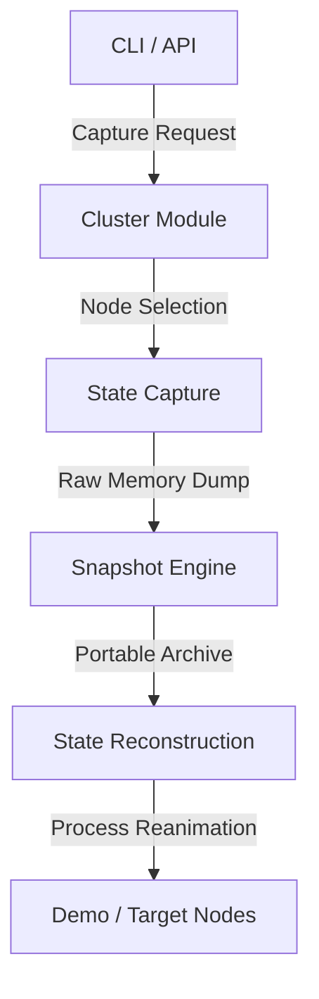

# 🏛️ WekezaOmniOS System Architecture

The **WekezaOmniOS** architecture is built on a decoupled, modular design. This allows the system to swap out components (like using a different snapshot compressor or a new OS adapter) without breaking the entire teleportation pipeline.

## 🏗️ Structural Overview

The system operates in a top-down hierarchy:

1. **Interaction Layer:** Where users or external scripts trigger actions.
2. **Orchestration Layer:** Where the "logic" of the teleportation jump is managed.
3. **Engine Layer:** The "Engine Room" where memory is actually manipulated and packaged.
4. **Execution Layer:** The target environment where the process eventually "lives."

---

## 🔄 Module Interconnectivity & Flow

The lifecycle of a teleportation event follows a strict linear path to ensure state integrity:

### 1. The Trigger: CLI / API

* **CLI:** Provides human-readable commands for developers (e.g., `wekeza teleport <pid>`).
* **API:** A FastAPI-powered control plane that allows programmatic teleportation, essential for automated load balancing at **Wekeza Bank**.

### 2. The Controller: Cluster Module

* Acts as the "Global Traffic Controller."
* **Heartbeat Monitoring:** Keeps track of which nodes are online.
* **Compatibility Check:** Ensures the target node has the correct **Runtime Adapter** and enough RAM to house the incoming process.

### 3. The Factory: State Capture & Snapshot Engine

* **State Capture:** The "Freeze-Ray." It uses **CRIU** to stop time for the PID and extract its memory pages.
* **Snapshot Engine:** The "Packaging Plant." It takes raw binary data and wraps it in a self-describing `.tar.gz` archive with a `metadata.json` passport.

### 4. The Rebirth: State Reconstruction

* **State Reconstruction:** The "Defroster." It takes the portable snapshot, adjusts it for the target OS via **Runtime Adapters**, and injects it back into the target kernel's process tree.

---

## ⚖️ Module Responsibility Matrix

| Module | Core Responsibility | Key Technology |
| --- | --- | --- |
| **CLI** | User Interface & Feedback | Python `argparse` / `click` |
| **API** | Remote Orchestration | `FastAPI`, `Uvicorn` |
| **Cluster** | Node Health & Metadata | `Redis` / `Etcd` (Phase 2) |
| **State Capture** | Memory & CPU Extraction | `CRIU`, `ptrace` |
| **Snapshot Engine** | Compression & Portability | `tarfile`, `zstandard` |
| **Reconstruction** | Address Space Mapping | `CRIU Restore` |

---

### ✅ Architecture Status: FINALIZED

With this document, we have locked in the "Rules of the Game." Every file we create in the `state-capture/` or `snapshot-engine/` folders must answer to this blueprint.
